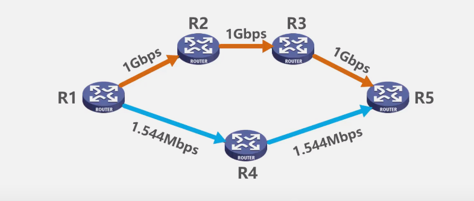
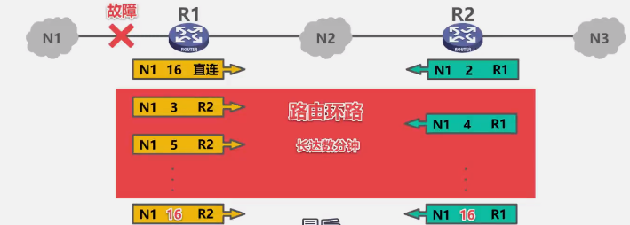
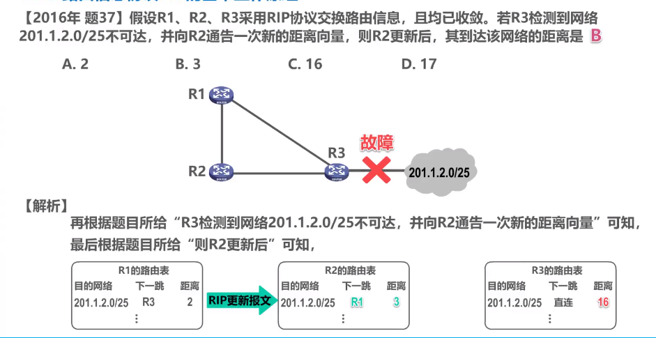
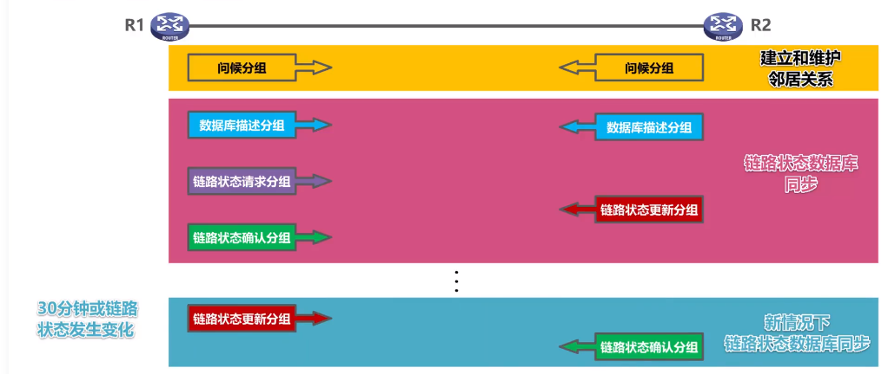
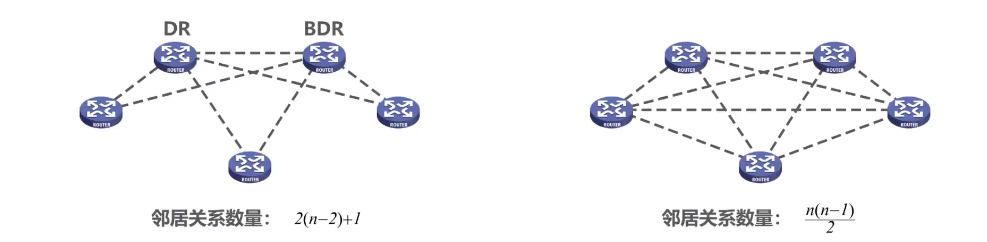
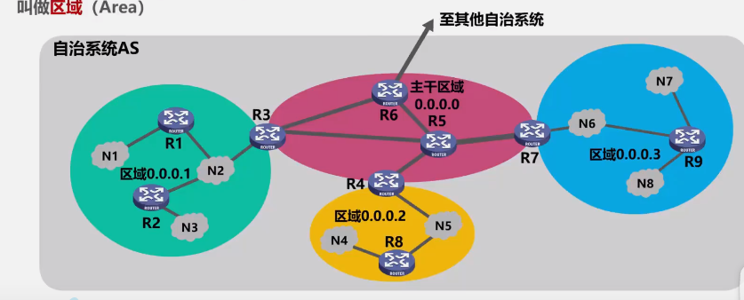
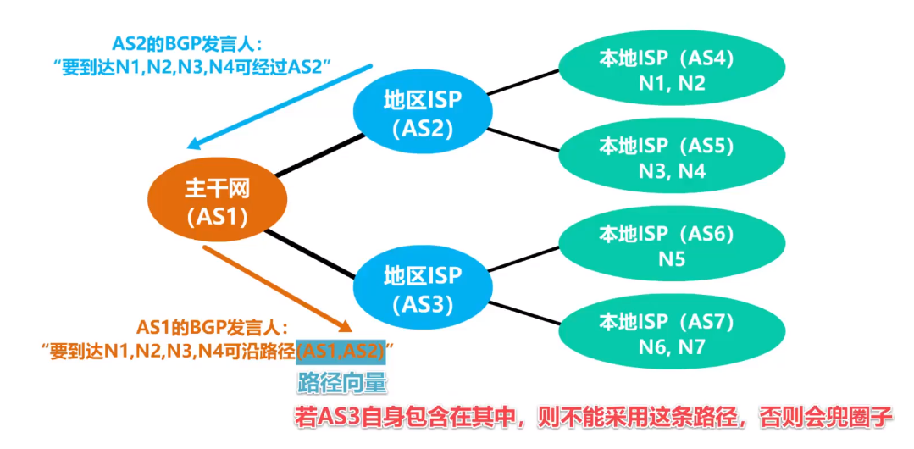
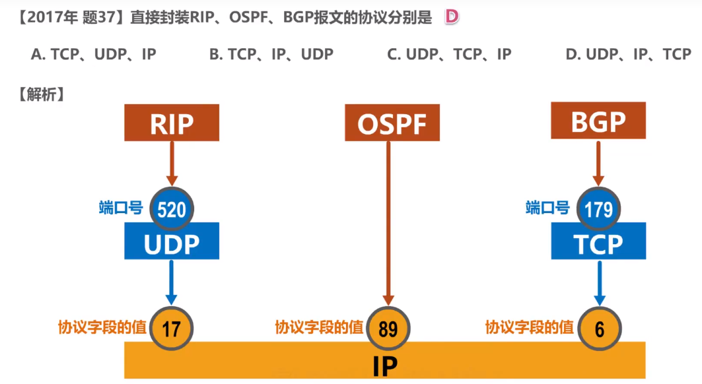
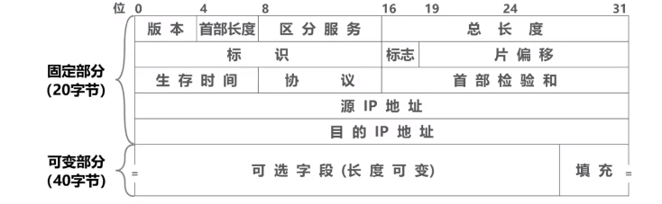

## 概述

- 网络层的主要任务: **实现网络互连**, 进而实现数据报再各网络之间的传输

- 要实现网络层任务, 需要解决以下的问题
  
  - 网络层向运输层提供怎样的服务 ("可靠传输" 还是 "不可靠传输")
  - 网络寻址问题
  - 路由选择问题
    - 人工配置
    - 实现路由选择协议

- **因特网**使用 **TCP/IP协议栈** 

- **TCP/IP协议栈**的网络层使用**网际协议IP**, 是整个协议栈的核心协议, 常称为**网际层**
  
  

## 网络层提供的两层服务

### 面向连接的虚电路服务

- **可靠通信由网络来保证**
- 必须建立**网络层的连接--虚电路 VC（Virtual Circuit）**
- 通信双方**沿着已经建立的虚电路发送分组**
- 目的主机的地址仅在连接建立阶段使用, 之后每个**分组的首部都只需携带一条虚电路编号**(构成虚电路的每一段链路都有一个虚电路编号)
- 使用可靠传输的网络协议实现可靠传输
- **通信结束后**, **需要释放之前建立的虚电路**

### 无连接的数据报服务

- **可靠通信由用户主机来保证**
- **不需要建立网络层连接**
- **每个分组可以走不通的路径**
- **首部必须携带完整地址**
- **分组可能重复, 失序, 误码, 丢失**
- **网络本身不提供端到端的可靠传输服务**, 路由器廉价
- 因特网采用这种设计思想: **复杂网络处理功能置于因特网边缘, **相对简单的网络交付功能置于因特网核心

## IP 地址

### IPv4 地址概述

- 分配给**每一台主机(或路由器)的每一个接口**

- IPv4 地址的编址方法
  
  - 分类编址
  - 划分子网
  - 无分类编址

- 32 比特不方便, 采用**点分十进制表示方法**
  
  

### 分类编址的 Ipv4 地址



**注意事项**

- 只有 A,B,C 类地址可以分配给网络中的主机
- 主机号全为 0 的是网络地址, 不能分配给主机或者路由器的各个接口
- 主机号全为 1  的是广播地址, 不能分配给主机或者路由器的各个接口



#### **A 类地址**

#### B 类地址

#### C 类地址

#### 练习题

 


0.0.0.0 是一个特殊的 IPv4 地址, 那个作为源地址使用, 表示"在本网络上的本主机", 封装有 DHCP Discovery 报文的 IP 分组源地址使用 0.0.0.0


### 划分子网的 IPv4 地址

#### 需求

随着网络发展, 主机数目不断增加, 并且需要将主机划分到独立的网络, 如果为新增的网络申请新的网络号会有以下弊端

- 需要等待时间更多的费用
- 增加其他路由器路由表记录的数量
- 浪费原有网络中剩余的大量 IP 地址

**解决方法——从主机号部分借用一部分作为子网号**

#### 子网掩码

**32 bit 的子网掩码可以表明分类 IP 地址的主机号部分被借用了几个 bit 作为网络号**

- 使用**连续的 bit 1 来对应网络号和子网号**
- 使用**连续的 bit 0 对应主机号**
- 将划分子网的 IPv4 地址与相应的子网掩码做逻辑与运算就可以得到 IPv4 地址所在的子网的网络地址

**划分子网的细节**

**默认的子网掩码是指未划分子网的情况下使用的子网掩码**

- A: 255.0.0.0
- B: 255.255.0.0
- C: 255.255.255.0

### 无分类编址的 IPv4 地址

- 划分子网一定程度上解决了困, 但是没有充分利用 C 类网, IPv4 面临消耗殆尽的局面

- IETF 提出采用**无分类编址**的方法解决 IP 地址紧张的局面, 同时成立 IPv6 工作组以彻底解决 IP 地址耗尽的问题

- **无分类域间路由**(Classless Inter-Domain Routing, CIDR)
  
  - CIDR 消除了传统的 A 类, B 类和 C 类地址, 以及划分子网的概念
  - **CIDR 可以更加有效地分配 IPv4 的地址空间**

- CIDR 使用"**斜线记法**", 或称 CIDR 记法, **斜线后面写网络前缀所占的比特数量**
  
  - 举例: 128.14.35.7/20, 网络前缀占用 20 位, 主机编号占用 32 - 20 = 12 位

- CIDR 实际上是将网络前缀都相同的连续的 IP 地址组成一个 "CIDR 地址块"
  
  - 只要知道其中一个地址, 就可以知道这个地址块的全部细节:
    
    - 包括最小地址, 最大地址, 地址数量, 聚合某类(A, B, C)网络的数量, 地址掩码(可继续称为子网掩码)
    
    举例: 给出 128.14.35.7/20 的全部细节
    
    
    
    聚合C类网: 用该地址中的地址数量/C类网的地址数量
    
    

- **路由聚合**(构造超网)
  
  - 两个路由器直接相连, 其中一个要将路由信息通告给另一个路由器, 就需要找**共同前缀**
    - 路由表中目的网络的共同前缀保持不变, 其余位取零, 就能得到聚合地址块
  - 网络前缀越长, 地址块越小, 路由越具体
  - 路由器转发分组时若有多条路有可选, 使用**最长前缀匹配**

### IPv4 地址的应用规划

#### 定长的子网掩码 (Fixed Length Subnet Mask, FLSM)

- 从主机号部分借用 n 位作为子网号, 则可分配 $$2^n$$ 个子网, 每个子网的主机数相同
  - 容易造成浪费

#### 变长的子网掩码(Variable Length Subnet Mask, VLSM)

从例子来看:

假设申请到的地址快是 218.75.230.0/24, 每一台主机一个地址, 每个子网有一个网络地址一个广播地址, 每个路由器接口有一个地址

- N1: 6 + 2 + 1 = 9; N2: 25 + 2 + 1 = 28; N3: 12 + 2 + 1=15;N4: 10 + 2 + 1 = 13; N5: 0 + 2 + 2 = 4;
- 所以需要 3 个 /28 地址块, 1 个 /27 地址块, 1 个 /30 地址块 
- 从大到小, 按需分配, **每个子快只能选取块大小整数倍的地址作为起点**, 以防止本该属于一个子网分配到下一个子网

## IP 数据报的发送和转发过程

> 重点放在 TCP/IP 协议栈的网际层**发送**和转发 IP 数据数据报的过程上, 以下内容省略了 ARP 和交换机自学习以及转发帧的过程

- 同一网络中的主机: 直接交付
- 不同网络中的主机: 间接交付, 通过路由器中转

### 间接交付

- 将自己的 IP 地址与自己的子网掩码相与得到自己的网络地址, 将目的 IP 地址与自己的子网掩码相与得到目的网络地址 (如果在同一个网络, 两个网络地址相等)

- **默认网关**: 本网络中的主机要与其他网络中的主机进行通信, 就必须给他指定一个本网络的路由器, 这个路由器被称为默认网关. 默认网关帮助主机将 IP 数据报转发出去
  
  

- 路由器转发过程
  
  1. 检查 IP 数据报首部是否出错
     
     - 出错: 丢弃, 告知源主机
     - 未出错: 进行转发
  
  2. 根据 IP 数据报的目的地址在路由表中查找匹配的条目:
     
     通过依次将目的地址与路由表中的地址掩码相与来判断
     
     
     
     - 找到: 转发给条目中指定的下一跳
     - 没找到: 丢弃并告知源主机

## 静态路由配置及其可能产生的路由环路问题

举例: 静态路由配置以及默认路由, 特定路由

 

### 静态路由配置错误导致路由环路

R2 本该将数据报转发给 R1 的接口 1,却错误地转发给了 R3 的接口 0, 导致了路由环路

- 为了避免IP 数据报在路由环路中永久兜圈, IP 数据报的首部设有**生存时间 TTL** 字段. IP 数据报进入路由器后, TTL 字段的值减一, 若 TTL 的值为 0, 则丢弃

### 聚合了不存在的网络导致路由环路

解决方法: 设置黑洞路由

​    

### 网络故障导致的路由环路

当 R1 直连网络 192.168.1.0/24 不可达的时候, 就会将路由表中的记录删除, 收到目的网络地址为 192.168.1.0/24 的数据报, 就会通过默认路由转发给 R2, 导致了环路

解决方法: 同样是设置黑洞路由

## 路由选择协议

### 路由选择协议概述

**静态路由选择**

- 由**人工配置**的网络路由, 默认路由, 特定主机路由, 黑洞路由都属于静态路由.
- 这种人工配置方式简单, 开销小. 但这不能及时适应网络状态(流量, 拓扑) 的变化.
- 一般只在**小规模网络中使用** 

**动态路由选择**

- 路由起通过路由选择协议**自动获取路由信息** 
- 比较复杂, 开销比较大, **能较好的适应网络状态的变化** 
- 适用于大规模网络

因特网采用的路由选择协议的主要特点

- 自适应: 动态路由选择, 较好地适应网络状态的变化
- 分布式: 各路由器之间交换路由信息, 共同完成路由信息的获取和更新
- 分层次: 将整个因特万划分为许多较小的自治系统(Autonomous System),
    一个较大的因特网服务提供商, 就可以划分为一个自治系统,
    在自治系统内外采用不同的路由选择协议
    
  - 内部: IGP 内部网关(路由器)协议
  - 外部: EGP 外部网关协议 

常见的路由选择协议

路由器的基本结构

- 路由选择部分
    根据使用的路由选择协议,周期性地与其他路由器进行路由信息的交互,
    来更新路由表

- 分组转发部分
  
  - 包含三个部分: 交换结构, 输入端口, 输出端口
  - $信号 \stackrel{物理层}{\rightarrow}bit 流 \stackrel {链路层}{\rightarrow} 帧 \stackrel{网络层} {\rightarrow} 书$

### 路由信息协议 RIP 的基本工作原理

- RIP (Routing Information Protocal) 是内部网关协议 IGP 中最先得到广泛使用的协议之一.

- RIP 要求自治系统 AS 内的每一个路由器都要维护从它自己到 AS 内其他每一个网络的距离记录. 这一组距离称为 "**距离向量 D-V**"

- RIP 使用 **跳数**(Hop Count) 作为度量 (Metric) 来**衡量到达目的网络得到距离**
  
  - 路由器到直连网络的距离定义为 1.
  - 路由器到非直连网络的距离定义为所经过的路由器数加 1.
  - 允许一条路径最多只能包含 15 个路由器. **"距离" 等于 16 时相当于不可达.** **RIP 只适用于小型互联网**

- RIP 认为 **好的路由** 就是"距离短"的路由, 也就是**所通过路由器数量最少的路由**. 下图中尽管 R1->R2->R3->R5 的带宽要大得多, RIP 仍认为最好的路由是 R1->R4->R5.
  
  

- 当到达统一目的网络有多条 "距离相等" 的路由时, 可以进行**等价负载均衡**

- RIP 包含以下三个要点:
  
  - **和谁交换信息**: 仅和**相邻路由器**交换信息
  - **交换什么信息**: 自己的**路由表**
  - **何时交换信息**: **周期性交换**

#### RIP 的基本工作过程

1. 路由器刚开始工作时, **只知道自己到直连网络的距离为 1**
2. 每个路由器**仅和相邻的路由器周期性交换并更新路由信息**
3. 若干次交换和更新后, **每个路由器都知道本 AS 内各自网络的最短距离和下一条地址, 称为收敛** 

#### RIP 路由条目的更新规则

假设更新周期到了, 路由器会将自己路由表中的相关路由信息封装到 RIP 更新报文中发送给另一个路由器(可以理解为将自己的路由表发送出去), 接收方收到路由表后对其进行改造, 将"下一跳" 改为来源路由器, 并将距离+1.

然后更新路由表, 更新的理由:

1. 到达目的网络, 相同的下一跳, 最新消息.
2. 发现了新的网络, 添加.
3. 到达目的网络, 不同的下一跳, 新路由优势, 更新.
4. 到达目的网络, 不同下一跳, 等价负载均衡.
5. 到达目的网络, 不同下一跳, 新路由劣势, 不更新.

内 

#### "坏消息传得慢" 问题

- 又称为**路由环路**或者**距离无穷计数**问题, 是距离向量算法的一个固有问题.
- 减少危害措施:
  - 相知最大路径距离为 15, 16 表示不可达.
  - 当路由表发生变化时立即发送更新报文("触发更新") 而不是周期性发送.
  - 让路由器记录收到某特定路由信息的接口, 而不让统一路由信息在通过此接口反向传送.("水平分割")

练习

R2 收到 R3 的报文后, 将下一跳距离改为 16. R2 更新后说明 R2 收到了 R1 的报文, 下一跳距离改为 3. 因为 R3 没有通告 R1.

### 开放最短路径优先 OSPF 的基本工作原理

- 开放最短路径优先 OSPF(Open Shortest Path First), 是为了克服 RIP 的缺点在 1989 年开发出来的.
  
  - Open 表示踏实公开发表的协议.
  - "最短路径优先" 是使用了 Dijkstra 的最短路径算法 SPF

- OSPF 基于**链路状态** 而非距离向量

- OSPF 使用 SPF 算法计算路由, 从算法上保证了**不会产生路由环路**

- OSPF **不限制网络规模**, 更新效率高, **收敛速度快**

- 链路状态是指本路由器和**哪些路由器相邻**, 以及**相应链路的代价**
  
  - "代价 " 用来表示费用, 距离, 带宽, 时延等等. 思科路由器用 100Mbps/带宽 的方式计算代价.

- OSPF 相邻路由器通过交互**问候(Hello)** 分组, 建立和维护邻居关系.
  
  - Hello 分组封装在 IP 数据报中, 发往组播地址 224.0.0.5.
  - 发送周期为 10 秒.
  - 40 秒未收到来自邻居路由器的 Hello 分组, 则认为该邻居路由器不可达
  
  

- **链路状态通告 LSA**(Link State Advertisement) 
  
  - 直连网路的链路状态信息
  - 邻居路由器的链路状态信息

- LSA 被封装在链路更新状态分组 LSU 中, 采用洪泛法发送. 

- 使用 OSPF 的每个路由器都有一个**链路状态数据库 LSDB**, 用于存储 LSA

- 通过个路由器洪泛发送封装有 自己 LSA 的 LSU 分组, 各路由器的 LSDB 最终将达到一致.

- 使用 OSPF 的各路由器基于 LSDB 进行**最短路径优先 SPF 计算**, 构建出各自到达其他路由器的最短路径, 即构建各自的路由表.

- OSPF 的物种分组类型
  
  - 问候(Hello)分组. 发现和维护邻居路由器的可达性.
  - 数据库描述(Database Description) 分组. 向邻居路由器给出自己的链路状态数据库从的所有链路状态项目得到摘要信息.
  - 链路状态请求(Link State Request) 分组. 向邻居路由器发送某些链路状态项目的详细信息.
  - 链路状态更新(Link State Update) 分组. 路由器使用这种分组将其链路状态进行洪泛发送, 即用洪泛法对全网更新链路状态.
  - 链路状态确认分组(Link State Acknowledgement) 分组. 这是对链路状态更新分组的确认分组.

- OSPF 的基本工作过程
  
  

- OSPF 在多点接入网络中路由器邻居关系的建立
  
  - 为了减少发送分组数量, 采用选举**指定路由器 DR**(designated router) 和 **备用指定路由器 BDR**(backup designated router).
  - **所有的非 DR/BDR 只与 DR/BDR 建立邻居关系**.
  - 非 DR/BDR 之间通过 DR/BDR 交换信息.
  
  

- 为了使 OSPF 能用于规模很大的网络, OSPF 把自治系统再划分为若干个更小的范围, 叫做**区域 (Area)**
  
  
  
  - 区域内路由器 IR:路由器的所有接口都在同一个区域内, 如 R1, R2, R8, R9.
  - 区域边界路由器 ABR : 使本区域可以和自治系统内的其他区域连通, 一个接口用于连接自身区域, 另一个接口用于连接主干区域. 如 R3, R4, R7 
  - 主干路由器 BBR: 主干区域的路由器. 区域边界的路由器也可以看作主干路由器.  
  - 自治系统边界路由器 ASBR: 与其他自治系统交换路由信息. 如 R6 
    
        

### 边界网关协议 BGP

因特网采用分层次的路由选择协议

**内部网关协议 IGP(例如路由信息协议RIP或开放最短路径优先OSPF)**

- 设法使分组在一个自治系统内尽可能有效地从源网络传输到目的网络 

- 无需考虑自治系统外部其他方面的策略 

**外部网关协议EGP(例如边界网关协议BGP)**

- 在不同自治系统内，度量路由的“代价”（距离，带宽，费用等）可能不同。 因此，对于自治系统之间的路由选择，使用“代价”作为度量来寻找最佳路由是不行的

- 自治系统之间的路由选择必须考虑相关策略（政治，经济，安全等）

- BGP只能是力求寻找一条能够到达目的网络且比较好的路由（不能兜圈子）， 而并非要寻找一条最佳路由

#### 边界网关协议的基本工作原理

- 在配置BGP时，每个自治系统的管理员要选择至少一个路由器作为该自治系统的"**BGP发言人**"

- 不同自治系统的BGP发言人要交换路由信息，首先必须建立**TCP连接**，端口号为179 
  
  - 在此TCP连接上交换BGP报文以建立**BGP会话** 
  
  - 利用BGP会话**交换路由信息**（例如，增加新的路由， 或撤销过时的路由，以及报告出错的情况等) 
  
  - 使用TCP连接交换路由信息的两个BGP发言人，彼此称为对方的**邻站**(neighbor)或**对等站** (peer)

- BGP发言人除了运行BGP外，还必须运行自己所在自治系统所使用的内部网关协议IGP,例如OSPF或RIP

- BGP发言人交换网络可达性的信息（要到达某个网络所要经过的一系列自治系统） 

- 当BGP发言人互相交换了网络可达性的信息后，各BGP发言人就根据所采用的策略从收到的路由信 息中找出到达各自治系统的较好的路由。也就是构造出树形结构、不存在回路的自治系统连通图

**BGP 适用于多级结构的因特网**

**BGP-4 有以下四种报文**

- OPEN 报文: 用来与相邻的另一个BGP发言人建立关系，使通信初始化

- UPDATE 报文: 用来通告某一路由的信息，以及列出要撤销的多条路由

- KEEPALIVE 报文: 周期性地正式称邻站的连通性

- NOTIFICATION 报文: 用来发送检测到的差错

练习题: 

## IPV4 数据报的首部格式

- 版本: 4 bit. IP 协议的版本, 广泛使用的是 IPV4

- 首部长度: 4 bit. 表示 IP 数据报首部的长度. 单位为 4 字节. 最小取值为 5, 表示数据报长度为 20 字节. 最大取值 为 15, 表示包含 20字节固定部分和 最大 40 字节可变部分

- 可选字段: 1 \~ 40 bit. 长度从1个字节到40个字节不等。用来支持排错、测量及安全等措施。 可选字段增加了IP数据报的功能，但这同时也使得 IP 数据报的首部长度成为可变的。这就增加了每一个路由器处理IP数据报的开销。实际上可选字段很少被使用

- 填充字段: 确保首部长度为 4 字节整数倍, 全零填充

- 区分服务: 8 bit. 用来获得更好的服务。 该字段在旧标准中叫作服务类型，但实际上一直没有被使用过。 1998年，因特网工程任务组IETF把这个字段改名为区分服务。 利用该字段的不同数值可提供不同等级的服务质量。 只有在使用区分服务时，该字段才起作用。一般情况下都不使用该字段

- 总长度: 16 bit.表示 IP 数据报的总长度(首部+数据载荷). 单位为字节

- 标识: 16 bit，属于同一个数据报的各分片数据报应该具有相同的标识。 IP 软件维持一个计数器，每产生一个数据报，计数器值加 1，并将此值赋给标识字段. **标识, 标志和片偏移**是数据报分片用的.

- 标志: 3 bit，各比特含义如下： 
  
  - DF位：1表示不允许分片： 0表示允许分片 
  
  - MF位：1表示“后面还有分片”： 0表示“这是最后一个分片”
  
  - 保留位: 必须为 0

- 片偏移: 13 bit分片数据报的数据载荷部分偏移其在原数据报的位置有多少个单位. 单位为 8 字节

- 生存时间 TTL: 占8比特，最初以秒为单位，最大生存周期为255秒：路由器转发1P数据报时，将P数据报首 部中的该字段的值减去P数据报在本路由器上所耗费的时间，若不为0就转发，否则就丢弃。 现在以“跳数”为单位，路由器转发P数据报时，将P数据报首部中的该字段的值减1，若不为0就转发，否则就丢弃

- 协议: 8 bit. 表示数据部分是何种协议数据单元
  
  | 协议名称  | ICMP | IGMP | TCP | UDP | IPv6 | IPv4 |
  | ----- | ---- | ---- | --- | --- | ---- | ---- |
  | 协议字段值 | 1    | 2    | 6   | 17  | 41   | 89   |

- 首部校验和: 检验首部传输过程中是否出现差错, 比 CRC 检验码简单. 每经过一个路由器, 都要重新计算. IP 本身并不提供可靠服务, IPv6 取消了首部校验和.

- 源 IP 地址和目的 IP 地址

## 网际控制报文协议 ICMP

为了更有效地转发 IP 数据报和提高交付成功的机会, 使用 ICMP (Internet Control Message Protocol)

主机或路由器使用 ICMP 来发送**差错报告报文**和**询问报文** 

**ICMP 报文封装在 IP 数据报中发送**

ICMP 差错报告报文共有五种:

- 终点不可达

- 源点抑制

- 时间超过

- 参数问题

- 改变路由(重定向)
