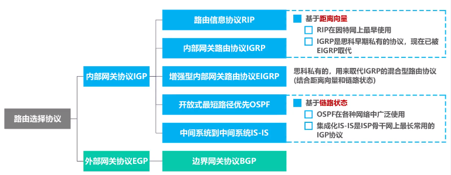

## 概述

- 网络层的主要任务: **实现网络互连**, 进而实现数据报再各网络之间的传输

- 要实现网络层任务, 需要解决以下的问题

  - 网络层向运输层提供怎样的服务 ("可靠传输" 还是 "不可靠传输")
  - 网络寻址问题
  - 路由选择问题
    - 人工配置
    - 实现路由选择协议

- **因特网**使用 **TCP/IP协议栈** 

- **TCP/IP协议栈**的网络层使用**网际协议IP**, 是整个协议栈的核心协议, 常称为**网际层**

  

## 网络层提供的两层服务

### 面向连接的虚电路服务

- **可靠通信由网络来保证**
- 必须建立**网络层的连接--虚电路 VC（Virtual Circuit）**
- 通信双方**沿着已经建立的虚电路发送分组**
- 目的主机的地址仅在连接建立阶段使用, 之后每个**分组的首部都只需携带一条虚电路编号**(构成虚电路的每一段链路都有一个虚电路编号)
- 使用可靠传输的网络协议实现可靠传输
- **通信结束后**, **需要释放之前建立的虚电路**

### 无连接的数据报服务

- **可靠通信由用户主机来保证**
- **不需要建立网络层连接**
- **每个分组可以走不通的路径**
- **首部必须携带完整地址**
- **分组可能重复, 失序, 误码, 丢失**
- **网络本身不提供端到端的可靠传输服务**, 路由器廉价
- 因特网采用这种设计思想: **复杂网络处理功能置于因特网边缘, **相对简单的网络交付功能置于因特网核心

## IP 地址

### IPv4 地址概述

- 分配给**每一台主机(或路由器)的每一个接口**

- IPv4 地址的编址方法

  - 分类编址
  - 划分子网
  - 无分类编址

- 32 比特不方便, 采用**点分十进制表示方法**

  

### 分类编址的 Ipv4 地址



**注意事项**

- 只有 A,B,C 类地址可以分配给网络中的主机
- 主机号全为 0 的是网络地址, 不能分配给主机或者路由器的各个接口
- 主机号全为 1  的是广播地址, 不能分配给主机或者路由器的各个接口



#### **A 类地址**

#### B 类地址

#### C 类地址

#### 练习题

 


0.0.0.0 是一个特殊的 IPv4 地址, 那个作为源地址使用, 表示"在本网络上的本主机", 封装有 DHCP Discovery 报文的 IP 分组源地址使用 0.0.0.0


### 划分子网的 IPv4 地址

#### 需求

随着网络发展, 主机数目不断增加, 并且需要将主机划分到独立的网络, 如果为新增的网络申请新的网络号会有以下弊端

- 需要等待时间更多的费用
- 增加其他路由器路由表记录的数量
- 浪费原有网络中剩余的大量 IP 地址

**解决方法——从主机号部分借用一部分作为子网号**

#### 子网掩码

**32 bit 的子网掩码可以表明分类 IP 地址的主机号部分被借用了几个 bit 作为网络号**

- 使用**连续的 bit 1 来对应网络号和子网号**
- 使用**连续的 bit 0 对应主机号**
- 将划分子网的 IPv4 地址与相应的子网掩码做逻辑与运算就可以得到 IPv4 地址所在的子网的网络地址

**划分子网的细节**

**默认的子网掩码是指未划分子网的情况下使用的子网掩码**

- A: 255.0.0.0
- B: 255.255.0.0
- C: 255.255.255.0

### 无分类编址的 IPv4 地址

- 划分子网一定程度上解决了困, 但是没有充分利用 C 类网, IPv4 面临消耗殆尽的局面
- IETF 提出采用**无分类编址**的方法解决 IP 地址紧张的局面, 同时成立 IPv6 工作组以彻底解决 IP 地址耗尽的问题
- **无分类域间路由**(Classless Inter-Domain Routing, CIDR)
  - CIDR 消除了传统的 A 类, B 类和 C 类地址, 以及划分子网的概念
  - **CIDR 可以更加有效地分配 IPv4 的地址空间**

- CIDR 使用"**斜线记法**", 或称 CIDR 记法, **斜线后面写网络前缀所占的比特数量**

  - 举例: 128.14.35.7/20, 网络前缀占用 20 位, 主机编号占用 32 - 20 = 12 位

- CIDR 实际上是将网络前缀都相同的连续的 IP 地址组成一个 "CIDR 地址块"

  - 只要知道其中一个地址, 就可以知道这个地址块的全部细节:

    - 包括最小地址, 最大地址, 地址数量, 聚合某类(A, B, C)网络的数量, 地址掩码(可继续称为子网掩码)

    举例: 给出 128.14.35.7/20 的全部细节

    

    聚合C类网: 用该地址中的地址数量/C类网的地址数量

    

- **路由聚合**(构造超网)

  - 两个路由器直接相连, 其中一个要将路由信息通告给另一个路由器, 就需要找**共同前缀**
    - 路由表中目的网络的共同前缀保持不变, 其余位取零, 就能得到聚合地址块
  - 网络前缀越长, 地址块越小, 路由越具体
  - 路由器转发分组时若有多条路有可选, 使用**最长前缀匹配**

  

### IPv4 地址的应用规划

#### 定长的子网掩码 (Fixed Length Subnet Mask, FLSM)

- 从主机号部分借用 n 位作为子网号, 则可分配 $$2^n$$ 个子网, 每个子网的主机数相同
  - 容易造成浪费

#### 变长的子网掩码(Variable Length Subnet Mask, VLSM)

从例子来看:

假设申请到的地址快是 218.75.230.0/24, 每一台主机一个地址, 每个子网有一个网络地址一个广播地址, 每个路由器接口有一个地址

- N1: 6 + 2 + 1 = 9; N2: 25 + 2 + 1 = 28; N3: 12 + 2 + 1=15;N4: 10 + 2 + 1 = 13; N5: 0 + 2 + 2 = 4;
- 所以需要 3 个 /28 地址块, 1 个 /27 地址块, 1 个 /30 地址块 
- 从大到小, 按需分配, **每个子快只能选取块大小整数倍的地址作为起点**, 以防止本该属于一个子网分配到下一个子网

## IP 数据报的发送和转发过程

> 重点放在 TCP/IP 协议栈的网际层**发送**和转发 IP 数据数据报的过程上, 以下内容省略了 ARP 和交换机自学习以及转发帧的过程

- 同一网络中的主机: 直接交付
- 不同网络中的主机: 间接交付, 通过路由器中转

### 间接交付

- 将自己的 IP 地址与自己的子网掩码相与得到自己的网络地址, 将目的 IP 地址与自己的子网掩码相与得到目的网络地址 (如果在同一个网络, 两个网络地址相等)

- **默认网关**: 本网络中的主机要与其他网络中的主机进行通信, 就必须给他指定一个本网络的路由器, 这个路由器被称为默认网关. 默认网关帮助主机将 IP 数据报转发出去

  

- 路由器转发过程

  1. 检查 IP 数据报首部是否出错

     - 出错: 丢弃, 告知源主机
     - 未出错: 进行转发

  1. 根据 IP 数据报的目的地址在路由表中查找匹配的条目:

     通过依次将目的地址与路由表中的地址掩码相与来判断

     

     - 找到: 转发给条目中指定的下一跳
     - 没找到: 丢弃并告知源主机

     

## 静态路由配置及其可能产生的路由环路问题

举例: 静态路由配置以及默认路由, 特定路由

 

### 静态路由配置错误导致路由环路

R2 本该将数据报转发给 R1 的接口 1,却错误地转发给了 R3 的接口 0, 导致了路由环路

- 为了避免IP 数据报在路由环路中永久兜圈, IP 数据报的首部设有**生存时间 TTL** 字段. IP 数据报进入路由器后, TTL 字段的值减一, 若 TTL 的值为 0, 则丢弃

### 聚合了不存在的网络导致路由环路

解决方法: 设置黑洞路由

​	

### 网络故障导致的路由环路

当 R1 直连网络 192.168.1.0/24 不可达的时候, 就会将路由表中的记录删除, 收到目的网络地址为 192.168.1.0/24 的数据报, 就会通过默认路由转发给 R2, 导致了环路

解决方法: 同样是设置黑洞路由

## 路由选择协议
### 路由选择协议概述
**静态路由选择**
- 由**人工配置**的网络路由, 默认路由, 特定主机路由, 黑洞路由都属于静态路由.
- 这种人工配置方式简单, 开销小. 但这不能及时适应网络状态(流量, 拓扑) 的变化.
- 一般只在**小规模网络中使用** 

**动态路由选择**
- 路由起通过路由选择协议**自动获取路由信息** 
- 比较复杂, 开销比较大, **能较好的适应网络状态的变化** 
- 适用于大规模网络

因特网采用的路由选择协议的主要特点
- 自适应: 动态路由选择, 较好地适应网络状态的变化
- 分布式: 各路由器之间交换路由信息, 共同完成路由信息的获取和更新
- 分层次: 将整个因特万划分为许多较小的自治系统(Autonomous System),
一个较大的因特网服务提供商, 就可以划分为一个自治系统,
在自治系统内外采用不同的路由选择协议
	
	- 内部: IGP 内部网关(路由器)协议
	- 外部: EGP 外部网关协议 

常见的路由选择协议

路由器的基本结构

- 路由选择部分
	根据使用的路由选择协议,周期性地与其他路由器进行路由信息的交互,
	来更新路由表

- 分组转发部分
	- 包含三个部分: 交换结构, 输入端口, 输出端口
	- $信号 \stackrel{物理层}{\rightarrow}bit 流 \stackrel {链路层}{\rightarrow} 帧 \stackrel{网络层} {\rightarrow} 书$
